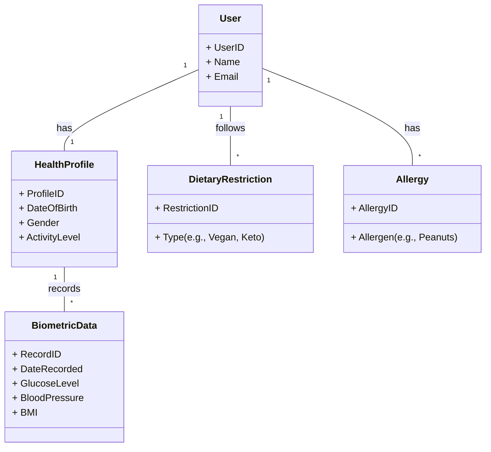
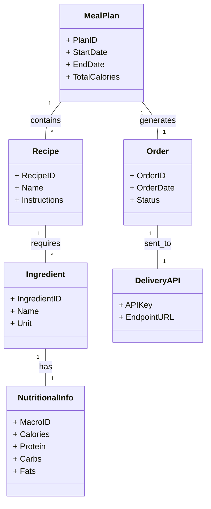

# Requirement Analysis Document: Just Eat
## 1. Fully Dressed Use Cases

### UC-01: Create Personalized Nutrition Plan

**ID:** UC-01  
**Primary Actor:** User

**Preconditions:** User has installed the Just Eat app and created an account

**Main Scenario:**
1. User opens the Just Eat app
2. User enters personal information (age, weight, activity level)
3. User enters allergies or dietary restrictions
4. System calculates macronutrient quotas
5. System generates a personalized meal plan

**Extensions:** User skips some health data → system generates a general nutrition plan

**Special Requirements:** User health data must be stored securely

---

### UC-02: Order Ingredients for Meal Plan

**ID:** UC-02  
**Primary Actor:** User

**Preconditions:** User already has a generated meal plan

**Main Scenario:**
1. User reviews their meal plan
2. User selects the option to order ingredients
3. System compiles a list of ingredients needed
4. System sends the order through the DoorDash or Kroger API
5. User receives confirmation of the order

**Extensions:** Delivery service unavailable → system notifies user

**Special Requirements:** Orders should only include fresh ingredients by default

---

### UC-03: Modify Meal Plan Within Nutrient Limits

**ID:** UC-03  
**Primary Actor:** User

**Preconditions:** User has an existing meal plan

**Main Scenario:**
1. User opens their meal plan
2. User selects a food item to remove
3. User chooses a replacement item
4. System checks if the replacement maintains macronutrient balance
5. System updates the meal plan

**Extensions:** Replacement exceeds nutrient limits → system rejects change

**Special Requirements:** System must display macronutrient values clearly

---

### UC-04: View Nutrition Information

**ID:** UC-04  
**Primary Actor:** User

**Preconditions:** User is logged into the app

**Main Scenario:**
1. User navigates to the nutrition information section
2. User searches for a nutrition or health topic
3. System retrieves information from trusted sources
4. System displays articles and research summaries

**Extensions:** No results found → system suggests related topics

**Special Requirements:** Sources such as PubMed or WebMD should be referenced

---

### UC-05: Navigate App via Mobile UI

**ID:** UC-05  
**Primary Actor:** User

**Stakeholders:**
- User: wants an intuitive, responsive interface to manage meal plan on the go
- Developer: wants UI that maps cleanly onto shared backend

**Preconditions:** User has installed the Just Eat mobile app and logged into their account

**Success Guarantee:** User can access all core features (meal plan, nutrition info, order management, health profile) through the mobile interface without layout or usability errors

**Main Scenario:**
1. User launches the app on their mobile device
2. System displays a home dashboard showing today's meal plan and macronutrient summary
3. User taps a navigation element to move between sections
4. System renders the selected section with appropriately scaled layouts for mobile
5. User interacts with a feature (e.g., reviews a meal, checks macros)
6. System reflects any changes in real time and syncs state with backend

**Extensions:**
- 3a. User is on a narrow screen → system falls back to simplified single-column layout
- 6a. Sync fails due to connectivity loss → system caches changes locally and retries on reconnect

**Special Requirements:**
- UI must remain usable on common mobile screen sizes (360px width and above)
- Touch targets must meet accessibility minimums
- Mobile UI and TUI must share same backend

**Technology Notes:** iOS and Android both supported; Push notifications are mobile-only and depend on OS-level permissions

---

### UC-06: Manage Meal Plan via TUI

**ID:** UC-06  
**Primary Actor:** Developer / Power User

**Stakeholders:**
- Developer: wants to test backend without mobile device
- Power user: wants keyboard-driven, scriptable interface for home setup

**Preconditions:** User has the Just Eat CLI installed and has authenticated with account credentials

**Success Guarantee:** User can view and interact with meal plan, profile, and orders entirely through terminal, with session state synchronized with mobile app

**Main Scenario:**
1. User launches the Just Eat TUI from the terminal
2. System renders text-based interface appropriate for detected terminal dimensions
3. User navigates menus using keyboard input to access meal plan, macronutrient breakdown, health profile, or order management
4. User performs an action (e.g., confirms today's meal plan for ordering)
5. System processes the action against shared backend
6. System updates TUI display and syncs state so mobile app reflects the change

**Extensions:**
- 2a. Terminal width is below usable threshold → system switches to simplified linear-menu layout
- 5a. Backend is unreachable → system displays clear error and queues action for retry
- 6a. Developer invokes command non-interactively → system processes command and exits with machine-readable output

**Special Requirements:**
- TUI layout must account for both desktop and narrow mobile terminal (Termux) form factors
- All TUI actions must go through same backend API used by mobile app
- Must be usable without graphical environment

**Technology Notes:** Terminal emulators vary; avoid features not universally supported; On IoT/home automation setups, CLI may be invoked non-interactively via scripts; support plain-text or JSON mode

---

### UC-07: Search Academic Literature In-App

**ID:** UC-07  
**Primary Actor:** User

**Stakeholders:**
- User: wants to look up nutrition and health research without leaving app
- User with rare condition: wants recent papers to inform dietary decisions

**Preconditions:** User is logged in and has navigated to the Nutrition Information section

**Success Guarantee:** User receives list of relevant results from PubMed and/or Google Scholar, with enough information to decide which results to read further

**Main Scenario:**
1. User opens the Nutrition Information section
2. User selects the academic search feature
3. User types a search query (e.g., "magnesium deficiency type 2 diabetes")
4. System submits query to PubMed and/or Google Scholar APIs
5. System displays result list showing each article's title, authors, publication year, and brief abstract excerpt
6. User taps or selects a result
7. System opens the article link in in-app browser view or hands off to device browser

**Extensions:**
- 4a. One API is unavailable → system retrieves results from available source only and notes partial result set
- 5a. No results are found → system suggests broadening query or offers related search terms
- 7a. Article is behind paywall → system indicates access status and surfaces link to PubMed free full-text version where available

**Special Requirements:**
- Queries must be sent over HTTPS
- Feature must clearly attribute results to their source (PubMed or Google Scholar)

**Technology Notes:** PubMed access uses NCBI E-utilities API (no authentication required for basic queries; API key recommended for higher rate limits); Google Scholar does not have official public API; integration may rely on third-party library or maintained scraping wrapper

---

### UC-08: Query AI Research Assistant

**ID:** UC-08  
**Primary Actor:** User

**Stakeholders:**
- User: wants synthesized, sourced answers about nutrition or health condition
- User with atypical medical condition: wants help aggregating sparse or conflicting research

**Preconditions:** User is logged in and has navigated to the Nutrition Information section

**Success Guarantee:** User receives clearly sourced, synthesized response to their research question, with underlying references listed for verification

**Main Scenario:**
1. User opens the AI research assistant within Nutrition Information section
2. User types a natural-language question (e.g., "What does recent research say about omega-3 supplementation for ADHD in adults?")
3. System sends query to integrated AI chatbot backend, which retrieves relevant literature
4. System displays synthesized response with inline citations linking to source articles
5. User follows up with clarifying question
6. System maintains conversational context and refines response accordingly
7. User taps a citation to view the source

**Extensions:**
- 3a. No sufficiently relevant literature found → system responds that it could not find strong evidence and suggests related, better-documented areas
- 4a. AI produces response that conflicts with user's algorithm settings → system appends notice reminding user that chatbot provides research context only
- 6a. User asks assistant to modify meal plan directly → system declines and redirects to meal plan modification flow

**Special Requirements:**
- Must display citations for all non-trivial claims
- Responses without sourcing should be clearly labeled as general context rather than evidence-based conclusions
- Must include visible disclaimer that assistant aggregates research and does not constitute medical advice
- Conversation history within session should not be stored server-side without explicit user consent

**Technology Notes:** AI backend may call external LLM API (e.g., Perplexity-style or RAG-based system); Latency may vary; UI should indicate when response is loading; Users with rare conditions may receive lower-quality responses if underlying model has limited training data

---

### UC-09: Set Dietary Preferences

**ID:** UC-09  
**Primary Actor:** User

**Stakeholders:**
- User: wants meal recommendations matching dietary preferences
- System: aims to generate appropriate meal plans based on preferences

**Preconditions:** User is logged into the Just Eat app

**Main Scenario:**
1. User opens the dietary preferences section
2. User selects preferred diet types (e.g., vegetarian, keto, vegan)
3. User selects foods they like or dislike
4. System saves the dietary preferences
5. System uses the preferences when generating future meal plans

**Extensions:** User leaves preferences blank → system generates meal plans without preference filtering

**Special Requirements:** Dietary preferences should be editable at any time

---

### UC-10: Optimize Grocery Order for Budget

**ID:** UC-10  
**Primary Actor:** User

**Stakeholders:**
- User: wants to minimize grocery costs while maintaining nutrition plan
- System: aims to select affordable ingredient options

**Preconditions:** User has generated a grocery list

**Main Scenario:**
1. User selects the option to optimize the grocery order for budget
2. System compares available product prices from the grocery provider
3. System selects lower-cost alternatives where possible
4. System updates the grocery list with optimized items
5. System displays the updated estimated total cost

**Extensions:** Cheaper alternative violates dietary restriction → system keeps the original ingredient

**Special Requirements:** System must ensure nutritional targets remain satisfied after optimization

---

### UC-11: Connect Grocery Delivery Provider

**ID:** UC-11  
**Primary Actor:** User

**Stakeholders:**
- User: wants to connect their grocery delivery service to the app
- System: aims to securely access provider APIs for ordering

**Preconditions:** User is logged into the app

**Main Scenario:**
1. User opens the grocery provider settings
2. User selects a provider such as DoorDash or Kroger
3. System redirects the user to the provider authentication page
4. User grants permission to connect the account
5. System stores the connection and confirms successful linking

**Extensions:** User cancels authentication → system returns to the provider selection screen

**Special Requirements:** Authentication tokens must be stored securely

---

### UC-12: Receive Meal Plan Notifications

**ID:** UC-12  
**Primary Actor:** User

**Stakeholders:**
- User: wants reminders and updates related to their meal plan
- System: aims to keep users engaged and informed

**Preconditions:** User has an active meal plan

**Main Scenario:**
1. System sends notifications for upcoming meals or grocery orders
2. User receives the notification on their device
3. User opens the notification to view details in the app
4. System displays the relevant meal plan or order information

**Extensions:** User disables notifications → system stops sending alerts

**Special Requirements:** Notifications should be configurable in user settings

---

### UC-13: Create User Account

**ID:** UC-13  
**Primary Actor:** User

**Stakeholders:**
- User: wants to create an account to store nutrition preferences and meal plans
- System: aims to securely manage user accounts

**Preconditions:** User has installed the Just Eat app

**Main Scenario:**
1. User opens the Just Eat app
2. User selects the option to create an account
3. User enters required information such as email and password
4. System validates the information
5. System creates a new user account
6. System logs the user into the app

**Extensions:** Email already exists → system notifies the user and asks them to sign in instead

**Special Requirements:** User passwords must be encrypted before being stored

---

### UC-14: Generate Grocery List from Meal Plan

**ID:** UC-14  
**Primary Actor:** User

**Stakeholders:**
- User: wants a clear list of ingredients needed for their meals
- System: aims to accurately organize ingredients from the meal plan

**Preconditions:** User has an existing meal plan

**Main Scenario:**
1. User selects the option to generate a grocery list
2. System collects ingredients from all meals in the meal plan
3. System combines duplicate ingredients and calculates quantities
4. System generates a grocery list
5. System displays the grocery list to the user

**Extensions:** Ingredient quantity missing → system estimates the required quantity

**Special Requirements:** Ingredients should be grouped into categories such as produce, dairy, and grains

---

### UC-15: Track Grocery Delivery

**ID:** UC-15  
**Primary Actor:** User

**Stakeholders:**
- User: wants to track the status of their grocery order
- System: aims to provide accurate delivery updates from the grocery provider

**Preconditions:** User has placed a grocery order

**Main Scenario:**
1. User opens the order tracking section
2. System retrieves delivery information from the grocery provider API
3. System displays the current order status
4. System shows the estimated delivery time

**Extensions:** Delivery information unavailable → system displays the last known order status

**Special Requirements:** Delivery status should update automatically when new information becomes available

---

### UC-16: Rate and Review Meals

**ID:** UC-16  
**Primary Actor:** User

**Stakeholders:**
- User: wants to provide feedback on meals they tried
- System: aims to improve future meal recommendations

**Preconditions:** User has generated or completed a meal plan

**Main Scenario:**
1. User opens a completed meal in the meal plan
2. User selects the option to rate the meal
3. User provides a rating and optional feedback
4. System stores the rating information
5. System uses the feedback to improve future recommendations

**Extensions:** User skips feedback → system saves only the rating

**Special Requirements:** Ratings should influence future meal suggestions generated by the system

## Dvillago's


## 2. Use Case Diagrams

### Diagram 1: User Configuration & Information
This diagram covers the setup and research aspects of the application.

```mermaid
useCaseDiagram
    actor "User" as User
    actor "Developer" as Dev

    package "Just Eat App" {
        usecase "UC1: Configure Nutrition Algorithm" as UC1
        usecase "UC2: Input Health Data" as UC2
        usecase "UC3: Search Nutritional Info" as UC3
        usecase "UC4: Use AI Chatbot" as UC4
        usecase "UC8: Sync CLI/Mobile" as UC8
    }

    User --> UC1
    User --> UC2
    User --> UC3
    User --> UC4
    Dev --> UC8
    User --> UC8
```

### Diagram 2: Meal Planning & Ordering
This diagram covers the core functional logic of generating and ordering meals.

```mermaid
useCaseDiagram
    actor "User" as User
    actor "System" as System
    actor "Delivery API (DoorDash/Kroger)" as API

    package "Just Eat App" {
        usecase "UC5: Generate Meal Plan" as UC5
        usecase "UC6: Order Ingredients" as UC6
        usecase "UC7: Modify Cart (Swap)" as UC7
    }

    User --> UC5
    UC5 --> UC6 : includes
    User --> UC7
    UC7 --> UC5 : extends
    
    UC6 --> API : communicates
```

---

## 3. Conceptual Class Diagrams

### Diagram 1: User Profile and Health Data
This class diagram visualizes the user's identity, their health metrics, and dietary constraints.



### Diagram 2: Meal Planning and Ordering
This class diagram visualizes the meal plan, ingredients, and the connection to external APIs.



---

## 4. Supplementary Specifications

This section outlines non-functional requirements (NFRs) that apply to the system as a whole, outside the specific use case descriptions.

| **ID** | **Non-Functional Requirement** | **Team Member** | **Description** |
| :--- | :--- | :--- | :--- |
| **NFR1** | **Data Privacy & Security** | Member 1 | The application must prioritize local data storage over cloud hosting to protect sensitive health checkup data. All health data must be encrypted at rest. This addresses the risk highlighted by recent cloud outages and privacy concerns. |
| **NFR2** | **Transparency of Algorithm** | Member 1 | The meal planning algorithm must be hard-coded and interpretable, not a black-box AI. Users must be able to trace how macronutrient quotas are calculated and met. |
| **NFR3** | **Platform Compatibility** | Member 2 | The application must support both a Mobile App (GUI) and a CLI (TUI) interface. The CLI must be usable on mobile terminals like Termux, ensuring synchronization between both interfaces. |
| **NFR4** | **Performance & Responsiveness** | Member 2 | The meal generation algorithm must complete calculations within 5 seconds on standard mobile hardware to ensure a smooth user experience. |
| **NFR5** | **Reliability of External Integrations** | Member 2 | The system must handle API failures (DoorDash/Kroger) gracefully, providing fallback options or clear error messages without crashing the application. |
| **NFR6** | **Usability of Information Retrieval** | Member 1 | The in-app search for medical research (PubMed/Scholar) must return results within 3 seconds and present them in a readable, casual format suitable for non-experts. |
