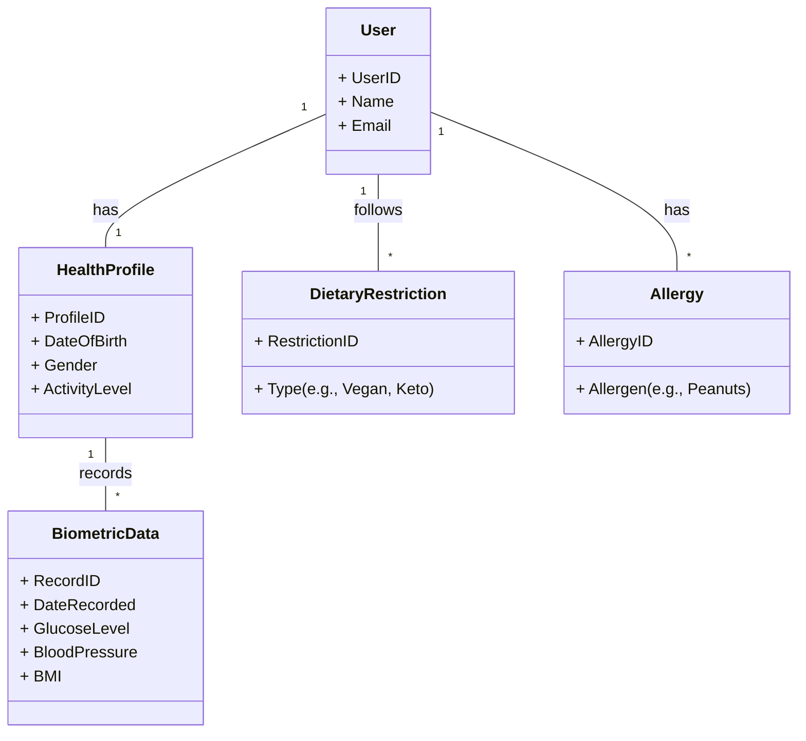
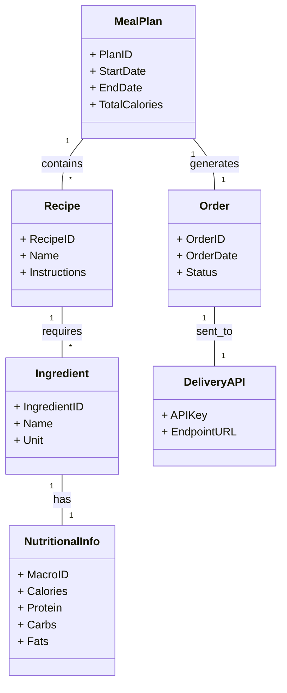

[! This is not a draft, but an AI-generated example for this assignment to be used as reference]

***

# Requirement Analysis Document: Just Eat

## 1. Fully Dressed Use Cases

### Team Member 1: User Profile & Algorithm Configuration

**Use Case UC1: Configure Nutrition Algorithm**
| **Use Case UC1: Configure Nutrition Algorithm** |
|---|
| **Primary Actor:** User |
| **Stakeholders and interests:** User: Wants to customize the meal planning algorithm to meet specific health goals and preferences; System: Needs valid parameters to generate plans. |
| **Preconditions** |
| The user has launched the application (CLI or Mobile). |
| **Success guarantee** |
| The user's nutritional parameters (macronutrient quotas, allergies, dietary restrictions) are saved and persistently stored. The system uses these new values for subsequent meal planning. |
| **Main success scenario** |
| 1. User selects "Settings" or "Algorithm Configuration." <br> 2. System displays current nutritional quotas and restrictions. <br> 3. User inputs daily calorie limits and macronutrient quotas (carbs, proteins, fats). <br> 4. User selects dietary restrictions (e.g., Vegan, Keto) and inputs allergies (e.g., Peanuts, Shellfish). <br> 5. User selects "Save Configuration." <br> 6. System validates inputs and stores the profile. |
| **Extensions** |
| 3a. User inputs invalid data (e.g., negative calories): System prompts error and requests correction. <br> 4a. User selects a recurring period (e.g., Ramadan fasting): System adjusts time windows for meal planning. |
| **Special requirements** |
| Configuration must be synchronized between CLI and Mobile interfaces. |
| **Technology and data variation list** |
| Data Storage: Local encrypted storage (preferred for privacy). Input: CLI arguments or GUI forms. |

**Use Case UC2: Input Health Checkup Data**
| **Use Case UC2: Input Health Checkup Data** |
|---|
| **Primary Actor:** User |
| **Stakeholders and interests:** User: Wants precise meal plans based on medical metrics; System: Needs biometric data to calculate accurate quotas. |
| **Preconditions** |
| User has physical or digital health checkup results available. |
| **Success guarantee** |
| Biometric data (e.g., blood glucose, cholesterol) is stored securely and linked to the algorithm for precision adjustments. |
| **Main success scenario** |
| 1. User navigates to "Health Data" section. <br> 2. System prompts for specific metrics (Glucose, Blood Pressure, BMI). <br> 3. User inputs data from recent checkup. <br> 4. User saves the data. <br> 5. System recalculates nutritional quotas based on the new health metrics. |
| **Extensions** |
| 3a. User inputs data outside safe physiological ranges: System issues a warning but allows saving (user discretion). |
| **Special requirements** |
| Data must be encrypted at rest. The app should ideally run locally to avoid cloud security risks regarding sensitive health data. |
| **Technology and data variation list** |
| Data: JSON or SQLite local storage. Input: Manual entry or photo OCR (future scope). |

**Use Case UC3: Search Nutritional Information**
| **Use Case UC3: Search Nutritional Information** |
|---|
| **Primary Actor:** User |
| **Stakeholders and interests:** User: Wants to verify nutritional facts or research medical conditions; System: Aggregates reliable health data. |
| **Preconditions** |
| User has an active internet connection. |
| **Success guarantee** |
| User receives a list of relevant research papers or medical articles related to their query. |
| **Main success scenario** |
| 1. User selects "Information" or "Research" tab. <br> 2. User enters a query (e.g., "effects of fasting on glucose"). <br> 3. System queries PubMed and Google Scholar APIs. <br> 4. System displays a list of abstracts and links. <br> 5. User selects an article to read. |
| **Extensions** |
| 3a. No results found: System suggests related terms or generic WebMD/FamilyDoctor links. <br> 4a. User asks the AI Chatbot for analysis: System summarizes the research. |
| **Special requirements** |
| The interface must handle varying screen sizes (Mobile vs. Desktop). |
| **Technology and data variation list** |
| APIs: PubMed API, Google Scholar scraping (or API). Data: HTML/Text rendering. |

**Use Case UC4: Use AI Chatbot for Research**
| **Use Case UC4: Use AI Chatbot for Research** |
|---|
| **Primary Actor:** User |
| **Stakeholders and interests:** User: Wants a summary of complex medical research; System: Provides synthesized information. |
| **Preconditions** |
| User is in the Information section and has a specific medical query. |
| **Success guarantee** |
| User receives a synthesized summary of relevant research, similar to Perplexity AI. |
| **Main success scenario** |
| 1. User activates the Chatbot interface. <br> 2. User inputs a query regarding a rare condition. <br> 3. System aggregates data from linked medical sites. <br> 4. System generates a concise summary with citations. <br> 5. User reviews the summary. |
| **Extensions** |
| 3a. Query is ambiguous: System asks clarifying questions. |
| **Special requirements** |
| The chatbot must cite sources clearly. It is not a diagnostic tool but an information aggregator. |
| **Technology and data variation list** |
| Technology: LLM integration (local or API). Data: Text generation. |

---

### Team Member 2: Meal Planning & Ordering

**Use Case UC5: Generate Meal Plan**
| **Use Case UC5: Generate Meal Plan** |
|---|
| **Primary Actor:** User |
| **Stakeholders and interests:** User: Wants a daily/weekly meal schedule that meets nutritional quotas; System: Optimizes ingredients based on hard-coded algorithm. |
| **Preconditions** |
| User profile and nutritional quotas are configured (UC1). |
| **Success guarantee** |
| A list of fresh ingredients and recipes is generated that strictly adheres to the macronutrient quotas. |
| **Main success scenario** |
| 1. User requests a "New Meal Plan" for the upcoming week. <br> 2. System runs the hard-coded optimization algorithm using current quotas. <br> 3. System selects fresh ingredients from the available catalog (Kroger/DoorDash). <br> 4. System displays the meal plan (recipes and ingredient list). <br> 5. User reviews the plan. |
| **Extensions** |
| 2a. Algorithm cannot meet exact quotas with available fresh ingredients: System suggests the closest match and prompts user approval. |
| **Special requirements** |
| The algorithm must be transparent (non-black box), allowing users to view how quotas were met. |
| **Technology and data variation list** |
| Data: Ingredient database, Recipe database. Logic: Optimization script. |

**Use Case UC6: Order Ingredients via API**
| **Use Case UC6: Order Ingredients via API** |
|---|
| **Primary Actor:** User / System |
| **Stakeholders and interests:** User: Wants fresh ingredients delivered; System: Automates the ordering process via DoorDash/Kroger API. |
| **Preconditions** |
| A valid meal plan has been generated (UC5). User has valid API credentials for DoorDash or Kroger. |
| **Success guarantee** |
| An order is placed successfully with the delivery service, and ingredients are scheduled for delivery. |
| **Main success scenario** |
| 1. User selects "Order Now" for the generated meal plan. <br> 2. System maps internal ingredient list to external API SKUs (Kroger/DoorDash). <br> 3. System constructs the cart via API. <br> 4. System processes the payment via saved credentials. <br> 5. System confirms the order and provides a tracking number. |
| **Extensions** |
| 3a. An item is out of stock: System selects a fresh substitute with similar nutritional value. <br> 4a. Payment fails: System notifies user to update payment method. |
| **Special requirements** |
| The system must strictly order "fresh ingredients only" as per default settings. |
| **Technology and data variation list** |
| APIs: DoorDash API, Kroger Developer API. Data: JSON payloads for cart creation. |

**Use Case UC7: Modify Cart (Swap Ingredients)**
| **Use Case UC7: Modify Cart (Swap Ingredients)** |
|---|
| **Primary Actor:** User |
| **Stakeholders and interests:** User: Wants to replace an ingredient with a preference; System: Ensures nutritional integrity is maintained. |
| **Preconditions** |
| A meal plan is generated, and an order cart is pending (before final submission). |
| **Success guarantee** |
| The ingredient is swapped, and the total macronutrient profile remains within the defined quotas. |
| **Main success scenario** |
| 1. User selects an ingredient in the current plan to remove. <br> 2. User selects a replacement ingredient. <br> 3. System calculates the nutritional difference. <br> 4. System verifies the replacement fits within the remaining macronutrient quota. <br> 5. System updates the cart. |
| **Extensions** |
| 3a. Replacement exceeds quota: System rejects the swap and suggests a lower-calorie alternative. |
| **Special requirements** |
| Users cannot arbitrarily add items; they must replace items to maintain nutritional balance. |
| **Technology and data variation list** |
| Data: Nutritional lookup table. Logic: Quota validation check. |

**Use Case UC8: Sync CLI and Mobile Interfaces**
| **Use Case UC8: Sync CLI and Mobile Interfaces** |
|---|
| **Primary Actor:** System / Developer |
| **Stakeholders and interests:** Developer: Wants consistent state across platforms; User: Wants to switch devices seamlessly. |
| **Preconditions** |
| Both CLI and Mobile app are installed/configured to access the same local data store or sync server. |
| **Success guarantee** |
| Changes made on one interface reflect immediately on the other. |
| **Main success scenario** |
| 1. User updates a setting on the Mobile App. <br> 2. Mobile app writes to the local database. <br> 3. CLI app reads the database on next execution. <br> 4. CLI displays the updated settings. |
| **Extensions** |
| 1a. Conflict detected (simultaneous edits): System prioritizes the latest timestamp. |
| **Special requirements** |
| The CLI must provide a TUI (Text User Interface) suitable for mobile terminals (e.g., Termux). |
| **Technology and data variation list** |
| Data: SQLite or JSON file sync. Interface: TUI (CLI) and GUI (Mobile). |

---

## 2. Use Case Diagrams

### Diagram 1: User Configuration & Information
This diagram covers the setup and research aspects of the application.

```mermaid
useCaseDiagram
    actor "User" as User
    actor "Developer" as Dev

    package "Just Eat App" {
        usecase "UC1: Configure Nutrition Algorithm" as UC1
        usecase "UC2: Input Health Data" as UC2
        usecase "UC3: Search Nutritional Info" as UC3
        usecase "UC4: Use AI Chatbot" as UC4
        usecase "UC8: Sync CLI/Mobile" as UC8
    }

    User --> UC1
    User --> UC2
    User --> UC3
    User --> UC4
    Dev --> UC8
    User --> UC8
```

### Diagram 2: Meal Planning & Ordering
This diagram covers the core functional logic of generating and ordering meals.

```mermaid
useCaseDiagram
    actor "User" as User
    actor "System" as System
    actor "Delivery API (DoorDash/Kroger)" as API

    package "Just Eat App" {
        usecase "UC5: Generate Meal Plan" as UC5
        usecase "UC6: Order Ingredients" as UC6
        usecase "UC7: Modify Cart (Swap)" as UC7
    }

    User --> UC5
    UC5 --> UC6 : includes
    User --> UC7
    UC7 --> UC5 : extends
    
    UC6 --> API : communicates
```

---

## 3. Conceptual Class Diagrams

### Diagram 1: User Profile and Health Data
This class diagram visualizes the user's identity, their health metrics, and dietary constraints.



### Diagram 2: Meal Planning and Ordering
This class diagram visualizes the meal plan, ingredients, and the connection to external APIs.



---

## 4. Supplementary Specifications

This section outlines non-functional requirements (NFRs) that apply to the system as a whole, outside the specific use case descriptions.

| **ID** | **Non-Functional Requirement** | **Team Member** | **Description** |
| :--- | :--- | :--- | :--- |
| **NFR1** | **Data Privacy & Security** | Member 1 | The application must prioritize local data storage over cloud hosting to protect sensitive health checkup data. All health data must be encrypted at rest. This addresses the risk highlighted by recent cloud outages and privacy concerns. |
| **NFR2** | **Transparency of Algorithm** | Member 1 | The meal planning algorithm must be hard-coded and interpretable, not a black-box AI. Users must be able to trace how macronutrient quotas are calculated and met. |
| **NFR3** | **Platform Compatibility** | Member 2 | The application must support both a Mobile App (GUI) and a CLI (TUI) interface. The CLI must be usable on mobile terminals like Termux, ensuring synchronization between both interfaces. |
| **NFR4** | **Performance & Responsiveness** | Member 2 | The meal generation algorithm must complete calculations within 5 seconds on standard mobile hardware to ensure a smooth user experience. |
| **NFR5** | **Reliability of External Integrations** | Member 2 | The system must handle API failures (DoorDash/Kroger) gracefully, providing fallback options or clear error messages without crashing the application. |
| **NFR6** | **Usability of Information Retrieval** | Member 1 | The in-app search for medical research (PubMed/Scholar) must return results within 3 seconds and present them in a readable, casual format suitable for non-experts. |